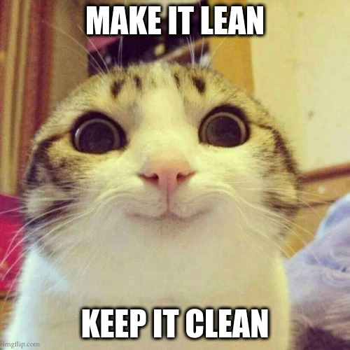

layout: true
class: no-class, center
background-image: url(./assets/images/slide_templates/Academy-title.png) 
background-size: cover
name: slide4

???
Remind folks to always destroy infrastructure if testing and maybe following along so as to avoid unnecessary costs

---
